# PawPal+ — Pet Care Scheduling System

> A Streamlit application that helps pet owners build realistic, conflict-free daily care plans for their pets.

---

## Table of Contents

1. [Overview](#overview)
2. [Features](#features)
3. [Architecture](#architecture)
   - [Initial Design (UML)](#initial-design-uml)
   - [Final Implemented Design (UML)](#final-implemented-design-uml)
4. [Getting Started](#getting-started)
5. [Testing](#testing)
6. [Code Coverage](#code-coverage)
7. [AI Assistant — RAG System](#ai-assistant--rag-system)
   - [Pipeline Diagram](#pipeline-diagram)
   - [Pipeline Components](#pipeline-components)
   - [Knowledge Base](#knowledge-base)
   - [Chunking Strategy](#chunking-strategy)
   - [Graceful Degradation](#graceful-degradation)
   - [Setup](#setting-up-the-ai-assistant)
8. [Full System Architecture](#full-system-architecture)
   - [Application Layout](#application-layout)
   - [Component Architecture](#component-architecture)
   - [Data Flow — Scheduling](#data-flow--scheduling)
   - [Data Flow — AI Assistant](#data-flow--ai-assistant)
   - [Technology Stack](#technology-stack)

---

## Overview

PawPal+ is built for busy pet owners who need help staying consistent with pet care. The system accepts owner and pet information, manages a task list with priorities and recurrence, and produces a 7-day care schedule — complete with conflict warnings and plain-language explanations.

---

## Features

### Task Management

- **Add / Edit / Remove Tasks** — Full lifecycle management: create tasks with a name, duration, priority (`high` / `medium` / `low`), and frequency (`daily` / `weekly` / `monthly`). Edit or remove tasks at any time.
- **Duplicate Prevention** — Adding the same task twice is silently ignored; the tracker keeps exactly one instance per task.
- **Deferred Activation (`active_from`)** — When a task is marked complete, the system automatically creates a fresh instance with an `active_from` date equal to the next due date. The task is hidden until that date arrives, preventing it from cluttering today's schedule.
- **Completion Logging** — Each `(task, date)` pair is recorded so the system knows which tasks have already been done on a given day.
- **Upcoming Task Countdown** — `get_upcoming_tasks()` looks 7 days ahead and returns all tasks that are due but not yet completed.
- **Owner Reminders** — `send_reminder()` broadcasts a reminder message to all owners linked to a pet.

### Scheduling Engine

- **7-Day Rolling Schedule** — The scheduler builds a plan covering today through the next 6 days, automatically advancing the window each run.
- **Priority-Based Sorting** — Tasks within each day are sorted `high → medium → low` using a fixed priority map (`{"high": 0, "medium": 1, "low": 2}`). Tasks with unknown priority levels sort last.
- **Recurrence Filtering** — Only tasks that are due on a given day are included: daily tasks appear every day, weekly tasks appear on Mondays, and monthly tasks appear on the 1st of each month.
- **Calendar-Aware Scheduling** — Days blocked by an event or marked as holidays are skipped entirely; no tasks are scheduled on unavailable days.
- **Multi-Pet Support** — A single owner can manage multiple pets simultaneously; the schedule aggregates tasks across all pets for each day.
- **Natural-Language Explanation** — `explain_schedule()` converts the raw schedule into a formatted, human-readable summary grouped by day, showing priority, pet name, task name, duration, and frequency.
- **Auto-Rescheduling after Completion** — `complete_task()` delegates to the tracker, which replaces the completed task with a new instance due on the next cycle date.

### Time-Aware Scheduling (UI Layer)

- **Free-Block Extraction** — The owner's day is split into free blocks around any configured busy window (e.g., work hours `08:00–17:00`). Tasks are only placed inside free blocks.
- **Sequential Single-Occurrence Placement** — Tasks that occur once per day are stacked one after another from the start of the first free block, spilling over to the next block if a task would overflow the current one.
- **Even Distribution for Multi-Occurrence Tasks** — Tasks that repeat multiple times per day (e.g., feeding 3×/day) are spread evenly across all free blocks by dividing each block into equal sub-intervals and centering each occurrence within its sub-interval.
- **Busy-Window Enforcement** — No task is ever placed inside a configured busy window; overflowing tasks advance to the next available free block rather than being dropped.

### Conflict Detection & Resolution

- **O(n²) Pairwise Overlap Detection** — Every pair of scheduled tasks on a given day is checked for time overlap. Two tasks conflict when one starts before the other ends.
- **Severity Classification** — Overlaps are classified by duration:

  | Severity | Overlap     | Indicator |
  |----------|-------------|-----------|
  | Minor    | 1–5 min     | 🟡 Yellow |
  | Moderate | 6–15 min    | 🟠 Orange |
  | Major    | > 15 min    | 🔴 Red    |

- **Color-Coded Summary Banner** — A banner appears at the top of each day's view immediately when conflicts exist, so problems are visible without scrolling.
- **Side-by-Side Task Cards** — Each conflict is displayed with both tasks shown next to each other, including their time range and priority.
- **Visual Timeline Bar** — A proportionally scaled bar renders each task as a colored block (blue / green) with the overlap region highlighted in red.
- **Priority-Aware Suggestion** — The system identifies which conflicting task has lower priority and recommends shortening it by exactly the overlap duration.
- **One-Click Auto-Fix** — Applying the suggestion requires a single button press; the task's duration is updated immediately.
- **Manual Override** — Either task's duration can be adjusted to any custom value via numeric inputs, giving the owner full control.
- **Severity-Driven Expander Behavior** — Major and Moderate conflict panels open automatically so critical issues are never missed; Minor conflict panels start collapsed to reduce visual noise.

### Data Persistence

- **JSON Persistence** — Owner profiles, pet data, tasks, and weekly availability are saved to `pawpal_data.json` on every change and reloaded on startup, so no data is lost between sessions.
- **Per-Day Weekly Availability** — Each day of the week can be individually configured with a start time, end time, and optional busy window, giving fine-grained control over when care tasks can be scheduled.

---

## Architecture

### Initial Design (UML)

The diagram below represents the class structure drafted during the design phase, before implementation began.

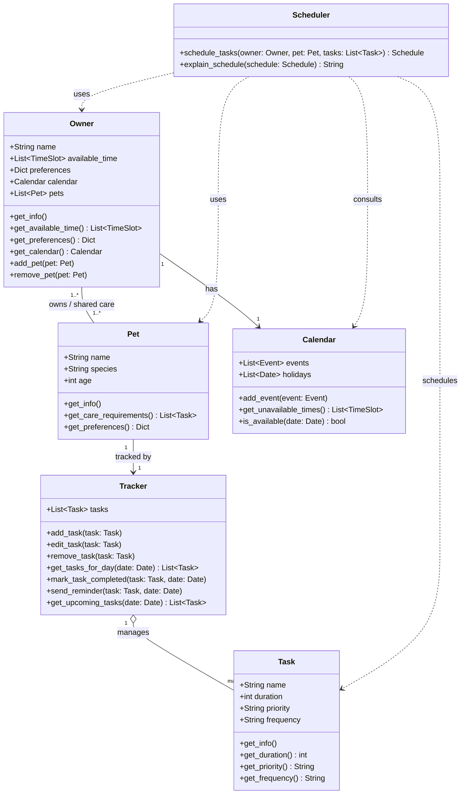

---

### Final Implemented Design (UML)

The diagram below reflects the actual class structure after implementation, including all attributes, methods, and relationships that were added or refined during development.

> Visual export:

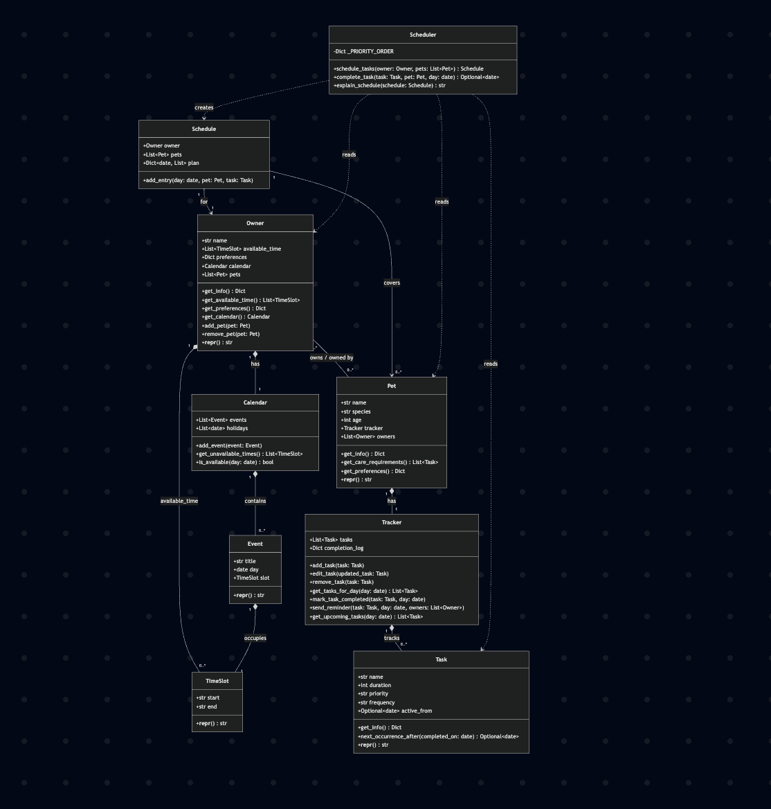

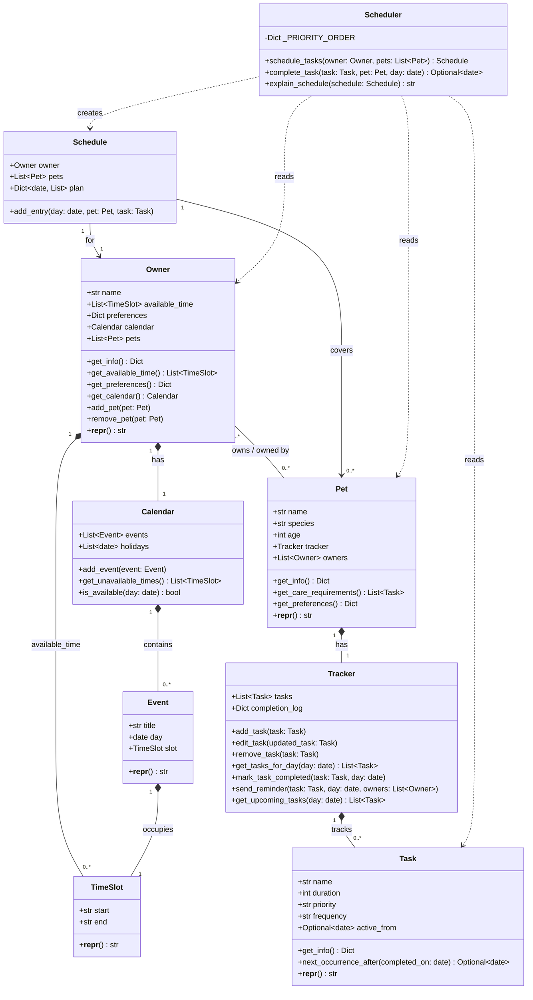

#### Class Responsibilities

| Class | Responsibility |
|-------|---------------|
| **TimeSlot** | Represents a `start`–`end` time window (strings like `"09:00"`). |
| **Event** | A named calendar event tied to a specific day and `TimeSlot`. |
| **Task** | A care task with name, duration, priority, frequency, and optional `active_from` date for deferred scheduling. |
| **Tracker** | Manages a pet's task list and completion log; handles auto-rescheduling via `active_from`. |
| **Pet** | A pet with species, age, and an embedded `Tracker`; participates in a many-to-many relationship with `Owner`. |
| **Calendar** | Stores events and holidays for an owner; answers availability queries. |
| **Owner** | A pet owner with available time slots, preferences, a `Calendar`, and a list of pets. |
| **Schedule** | The output of scheduling: a day-keyed plan of `(Pet, Task)` pairs for a given owner. |
| **Scheduler** | Stateless service that builds a 7-day `Schedule`, marks tasks complete, and produces human-readable summaries. |

#### Key Design Decisions

- **Many-to-many Owner ↔ Pet** — `Owner.add_pet()` and `Owner.remove_pet()` keep both sides (`owner.pets` and `pet.owners`) in sync.
- **Deferred scheduling via `active_from`** — When a task is marked complete, `Tracker.mark_task_completed()` replaces it with a new instance whose `active_from` is set to the next due date, hiding it until then.
- **Priority ordering** — `Scheduler._PRIORITY_ORDER = {"high": 0, "medium": 1, "low": 2}` drives sort order inside `schedule_tasks()` and the app-level `_tasks_due_on()`.
- **Conflict detection** (`app.py`) — `_detect_conflicts()` scans all scheduled slots for overlapping `_start_raw`/`_end_raw` pairs using an O(n²) pairwise check.
- **Scheduling engine** (`app.py`) — `_build_slots()` separates single-occurrence tasks (stacked sequentially) from multi-occurrence tasks (spread proportionally across free blocks by duration).

---

## Getting Started

### Prerequisites

- Python 3.10+
- pip

### Setup

```bash
python -m venv .venv
source .venv/bin/activate  # Windows: .venv\Scripts\activate
pip install -r requirements.txt
```

### Run the App

```bash
streamlit run app.py
```

---

## Testing

The test suite lives in [`tests/test_pawpal.py`](tests/test_pawpal.py) and provides comprehensive coverage of the core scheduling engine, conflict detection, and domain model — **131 tests, all passing**.

### Running the Tests

```bash
# Activate your virtual environment first
source .venv/bin/activate  # Windows: .venv\Scripts\activate

# Run all tests
python -m pytest

# Run with detailed output
python -m pytest -v

# Filter by category
python -m pytest -v -k "Conflict"
```

**Last run result:**

```
131 passed, 1 warning in 0.32s
```

To also generate a coverage report:

```bash
pip install pytest-cov
python -m pytest --cov=pawpal_system --cov-report=term-missing
```

### Test Distribution

The 131 tests are organized into **5 functional categories**.

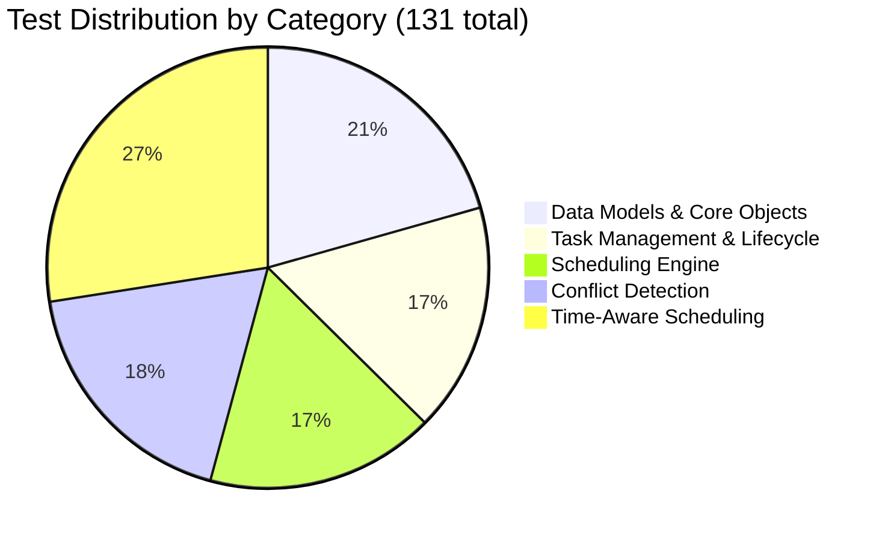

#### 1. Data Models & Core Objects — 27 tests

Validates that every domain object is constructed correctly, exposes the right data, and maintains accurate relationships.

| Test Class | Tests | What Is Verified |
|---|:---:|---|
| `TestTask` | 2 | Field values, string representation |
| `TestTimeSlot` | 1 | String representation |
| `TestEvent` | 1 | String representation |
| `TestCalendar` | 5 | Adding events, holiday blocking, availability queries, unavailable-time retrieval |
| `TestPet` | 7 | Pet info, care requirements, species-based schedule preferences, owner linkage |
| `TestOwner` | 9 | Owner info, bidirectional pet linking, duplicate prevention, shared-pet multi-owner scenarios |

#### 2. Task Management & Lifecycle — 22 tests

Covers the full lifecycle of a task: creation, editing, removal, completion, reminders, and the `active_from` gate.

| Test Class | Tests | What Is Verified |
|---|:---:|---|
| `TestTracker` | 14 | Add / remove / edit tasks, deduplication, frequency filtering, completion logging, upcoming-task countdown, reminder output |
| `TestTrackerActiveFrom` | 5 | Task hidden before `active_from`; visible on and after the activation date (daily and weekly variants) |

#### 3. Scheduling Engine — 22 tests

End-to-end tests of the `Scheduler` class, including day ordering, recurrence, and natural-language output.

| Test Class | Tests | What Is Verified |
|---|:---:|---|
| `TestScheduler` | 9 | Schedule generation, daily task inclusion, unavailable-day skipping, priority ordering, `explain_schedule` content |
| `TestChronologicalOrdering` | 5 | Plan days in ascending order, only future/today dates included, 7-day window enforced |
| `TestRecurrenceLogic` | 6 | Completed task reappears the next cycle, `active_from` advances correctly after completion |

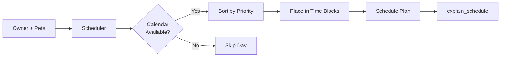

#### 4. Conflict Detection — 24 tests

Verifies the overlap-detection algorithm and severity classifier across all boundary conditions.

| Test Class | Tests | What Is Verified |
|---|:---:|---|
| `TestDetectConflicts` | 9 | No-conflict cases, partial overlap, identical slots, full containment, three-slot multi-pair scenarios |
| `TestConflictSeverity` | 8 | Boundary values for Minor / Moderate / Major thresholds, correct emoji and color codes |
| `TestSchedulerConflictDetection` | 5 | Duplicate start times flagged, both task names surfaced, sequential tasks not flagged |

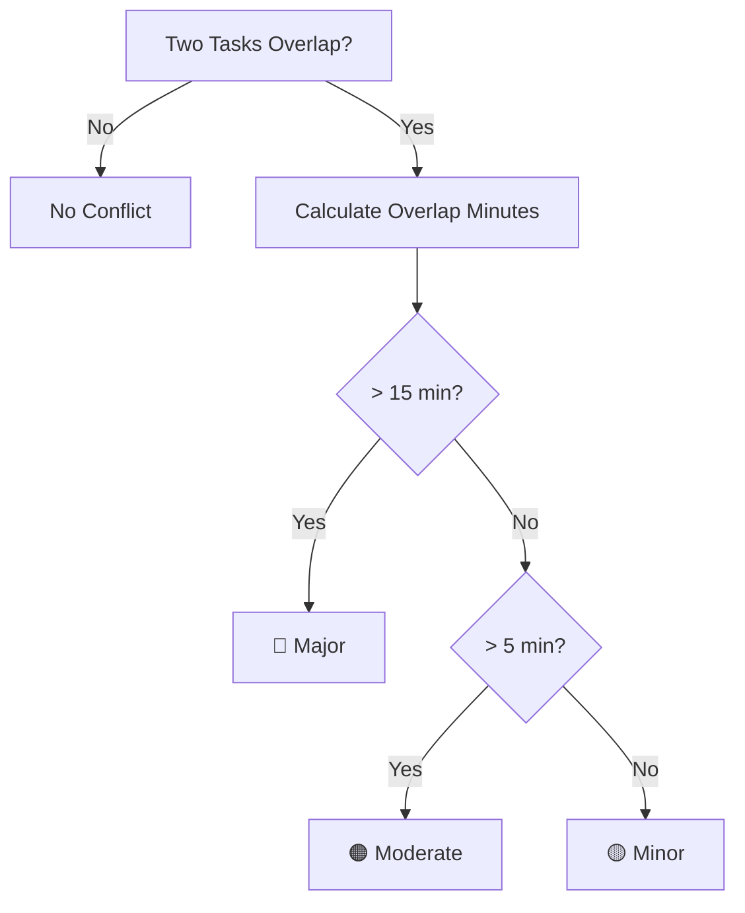

#### 5. Time-Aware Scheduling — 36 tests

Tests task placement within free time blocks, busy-period enforcement, and multi-occurrence distribution.

| Test Class | Tests | What Is Verified |
|---|:---:|---|
| `TestTasksDueOnFiltering` | 7 | Daily / weekly / monthly tasks filtered to correct days, multi-pet scenarios, empty edge cases |
| `TestTasksDueOnSorting` | 3 | High → Medium → Low priority order, unknown priorities sort last |
| `TestTimesPerDay` | 7 | Correct slot count per occurrence, distinct start times, even spread, chronological ordering |
| `TestBusyTimeExclusion` | 6 | No slots when fully busy, tasks placed inside free blocks, overflow advances to the next block |

### Edge Case Coverage

Of the 131 total tests, **42 explicitly target edge and boundary conditions** (~32%).

| Edge Case Category | Count | Representative Tests |
|---|:---:|---|
| **Empty / Null Inputs** | 8 | No pets, no tasks, empty conflict list, empty schedule, empty care requirements |
| **Boundary Values** | 9 | Conflict severity at exactly 5, 6, and 15 minutes; `active_from` on exact activation date; 7-day window boundary |
| **Invalid / Unknown Inputs** | 4 | Unknown priority level (`"urgent"`), editing a non-existent task, removing an absent task |
| **Blocked / Unavailable Scenarios** | 6 | No free time blocks, fully busy calendar day, holiday blocking, overflow to next block |
| **Duplicate Prevention** | 4 | Adding the same task twice, adding the same pet twice, duplicate owner–pet links |
| **Completion & Recurrence** | 5 | Completed task absent on same day, reappears next cycle, monthly task unchanged |
| **Conflict Geometry** | 4 | Identical start/end times, complete containment, sequential (touching) slots, gap between slots |
| **Isolation & Independence** | 2 | Blocking one owner's calendar does not affect another's; completion log keyed by object identity |

---

## Code Coverage

The test suite targets `pawpal_system.py` — the entire backend logic layer.

| Module | Statements | Missed | Coverage |
|---|:---:|:---:|:---:|
| `pawpal_system.py` | 168 | 0 | **100%** |
| **Total** | **168** | **0** | **100%** |

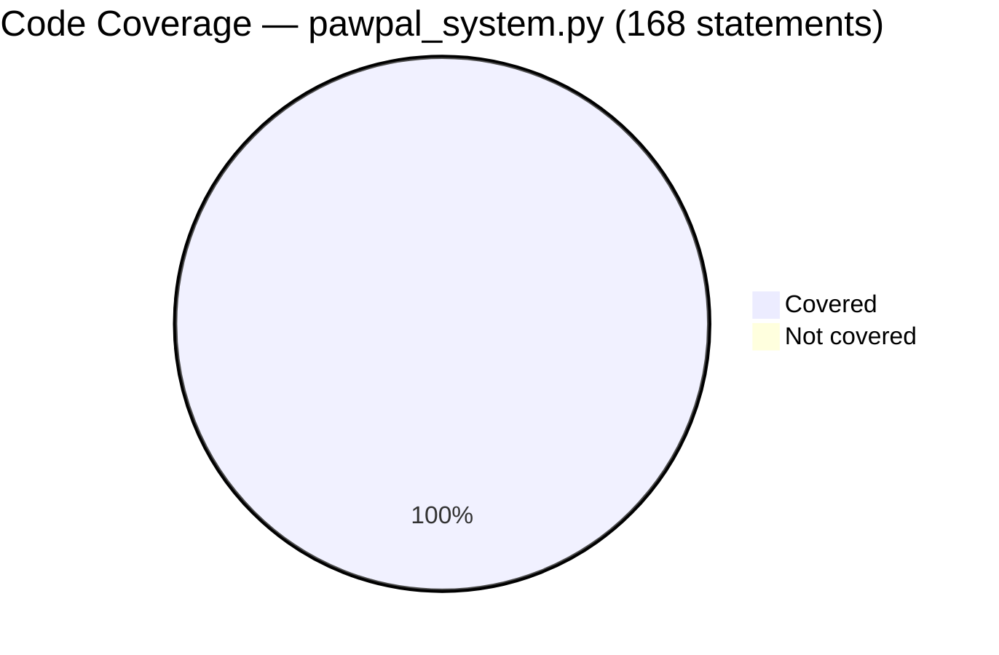

```
Confidence Level: ★★★★☆  (4 / 5)
```

**Strengths:** The entire backend (`pawpal_system.py`) is covered at 100% — all 168 statements are exercised across 5 functional layers with 42 dedicated edge and boundary cases.

**Gap:** The Streamlit UI layer (`app.py`) and AI-assisted explanation features are not covered by automated tests. Adding integration or snapshot tests for the UI would push this to 5 stars.

> Coverage is measured against `pawpal_system.py` only. The Streamlit UI (`app.py`) is excluded from the automated test run.

---

## AI Assistant — RAG System

PawPal+ ships with an embedded AI assistant powered by a **Retrieval-Augmented Generation (RAG)** pipeline. Every response is grounded in a curated knowledge base of pet care guides and vet profiles — no cloud API key, no hallucinations.

---

### Pipeline Diagram

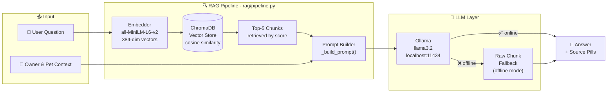

---

### Pipeline Components

| # | Module | Role |
|---|---|---|
| 1 | `rag/embedder.py` | Lazy-loads `all-MiniLM-L6-v2`; converts any text to a 384-dim float vector |
| 2 | `rag/vector_store.py` | Wraps ChromaDB with `upsert`, `query` (cosine), and `count`; persists index at `chroma_db/` |
| 3 | `rag/llm.py` | POSTs to Ollama REST API; returns `None` on `ConnectionError` so the pipeline can degrade gracefully |
| 4 | `rag/pipeline.py` | Orchestrates retrieval → prompt assembly → LLM call → fallback; single public function `ask()` |
| 5 | `setup_rag.py` | One-time indexer: reads all KB files, chunks them, embeds, and upserts into ChromaDB |

---

### Knowledge Base

```
knowledge_base/
├── pet_care/          ← 5 species care guides
│   ├── dogs.txt
│   ├── cats.txt
│   ├── birds.txt
│   ├── rabbits.txt
│   └── fish.txt
└── doctors/           ← 6 veterinarian profiles
    ├── dr_sarah_chen.txt
    ├── dr_james_wilson.txt
    ├── dr_emily_rodriguez.txt
    ├── dr_michael_patel.txt
    ├── dr_lisa_thompson.txt
    └── dr_omar_hassan.txt
```

| Category | Files | What Is Indexed |
|---|:---:|---|
| 🐾 **Pet Care** | 5 | Species-specific nutrition, exercise, grooming, health, and behaviour guides |
| 🩺 **Vet Doctors** | 6 | Doctor names, specialisations, available days/hours, consultation fees, booking contacts |
| **Total** | **11** | ~300+ chunks indexed at 200 words each with 30-word overlap |

---

### Chunking Strategy

```
Raw text file (e.g. dogs.txt)
        │
        ▼  chunk_text(chunk_size=200, overlap=30)
┌─────────────────┐
│   Chunk 1       │  words  0 – 199
└────────┬────────┘
         │ 30-word overlap keeps context intact across boundaries
┌────────▼────────┐
│   Chunk 2       │  words 170 – 369
└────────┬────────┘
         │
┌────────▼────────┐
│   Chunk 3       │  words 340 – 539
└─────────────────┘
         ·
         ·  stored in ChromaDB with metadata:
            { source, category, file }
```

---

### Graceful Degradation

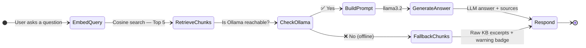

The UI always displays a `● Ollama online / offline` status badge in the sidebar so users know which mode is active.

---

### Setting Up the AI Assistant

```bash
# 1. Install AI dependencies
pip install sentence-transformers chromadb

# 2. Install and start Ollama  (https://ollama.com)
ollama pull llama3.2

# 3. Index the knowledge base — run once
python setup_rag.py
# Expected output:
#   dogs.txt          18 chunks
#   cats.txt          15 chunks
#   ...
#   Total chunks: ~300
#   Done! ChromaDB now contains N indexed chunks.

# 4. Launch the app
streamlit run app.py
# → Click "Open Chat →" on the home page to reach the AI assistant
```

---

## Full System Architecture

### Application Layout

The project is structured as a **Streamlit multi-page app** with three distinct layers:

```
applied-ai-system-project/
│
├── app.py                        ← Navigation entrypoint (st.navigation)
│
├── pages/
│   ├── Home.py                   ← Scheduling dashboard  (~1 500 lines)
│   └── Pet_Care_Assistant.py     ← AI chat interface     (~350 lines)
│
├── pawpal_system.py              ← Domain model & scheduling engine
│
├── rag/                          ← RAG pipeline (5 modules)
│   ├── __init__.py
│   ├── embedder.py               ← Sentence-Transformers wrapper
│   ├── llm.py                    ← Ollama REST client
│   ├── vector_store.py           ← ChromaDB wrapper
│   └── pipeline.py               ← ask() orchestrator
│
├── knowledge_base/               ← 11 plain-text documents
│   ├── pet_care/   (5 files)
│   └── doctors/    (6 files)
│
├── chroma_db/                    ← Persisted vector index (auto-created)
├── setup_rag.py                  ← One-time indexer
├── tests/                        ← 131 pytest tests
└── pawpal_data.json              ← Runtime JSON store (auto-created)
```

---

### Component Architecture

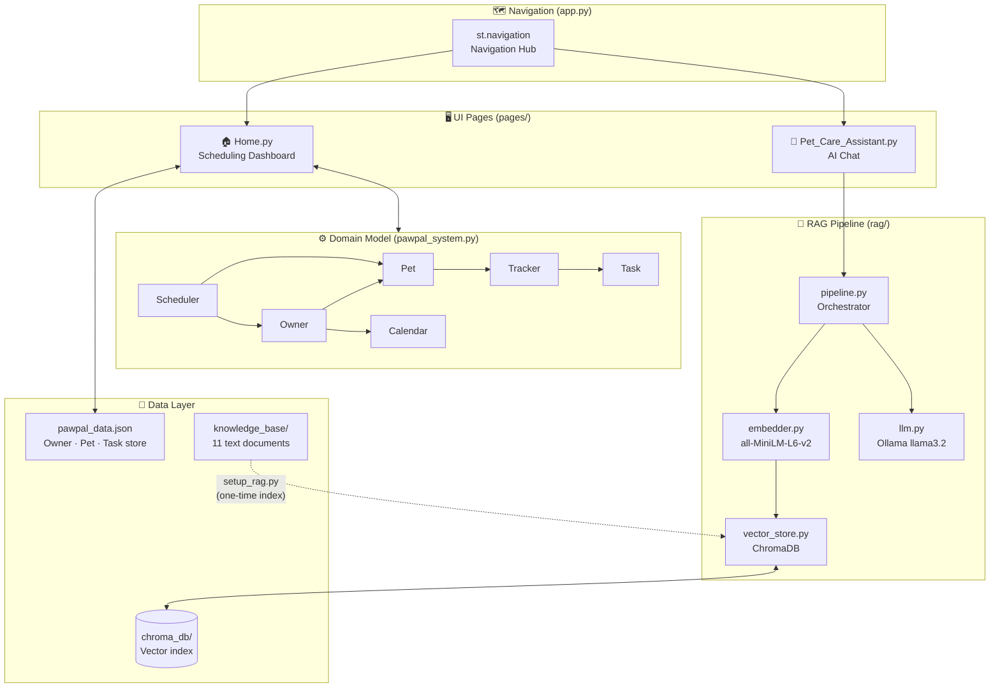

---

### Data Flow — Scheduling

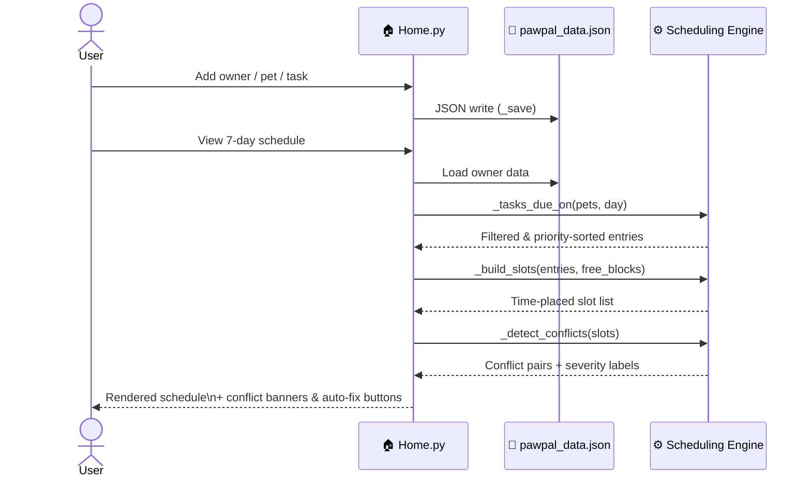

---

### Data Flow — AI Assistant

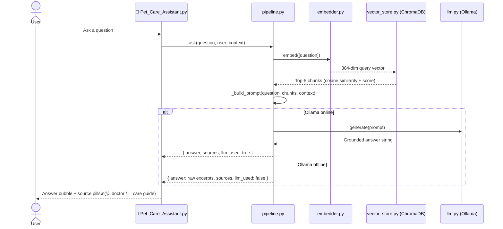

---

### Technology Stack

| Layer | Technology | Version | Purpose |
|---|---|---|---|
| **UI Framework** | Streamlit | ≥ 1.36 | Multi-page reactive web app with `st.navigation` |
| **Domain Model** | Pure Python | 3.12 | Owner / Pet / Task / Scheduler / Tracker classes |
| **Embeddings** | `sentence-transformers` | ≥ 2.7 | `all-MiniLM-L6-v2` — 384-dim semantic vectors |
| **Vector DB** | ChromaDB | ≥ 0.5 | Cosine-similarity retrieval, persisted on disk |
| **LLM Runtime** | Ollama `llama3.2` | local | Local inference — no cloud API key required |
| **Data Store** | JSON | — | Lightweight persistence for app data |
| **Test Suite** | pytest | ≥ 7.0 | 131 tests · 100 % backend coverage |
