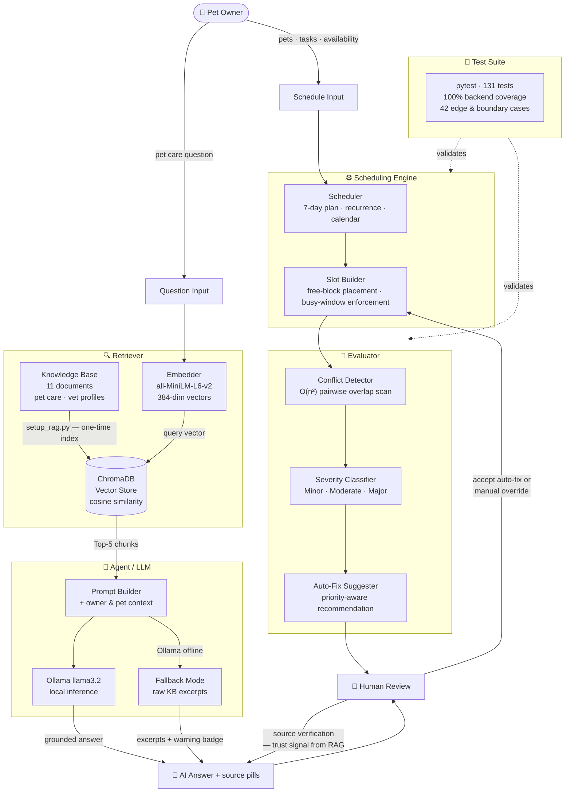

# PawPal+

> AI-powered pet care scheduling with a local RAG pipeline — no cloud API key required.

PawPal+ was built for pet owners who struggle to stay consistent with care routines. It combines a structured 7-day scheduling engine with an embedded AI assistant that can answer pet care questions and surface vet availability — all running locally on your machine. The goal was to make AI genuinely useful in a domain-specific context, not just a chatbot bolted on top.

---

## Table of Contents

1. [Architecture Overview](#architecture-overview)
2. [Setup Instructions](#setup-instructions)
3. [Sample Interactions](#sample-interactions)
4. [Design Decisions](#design-decisions)
5. [Testing Summary](#testing-summary)
6. [Reflection](#reflection)

---

## Architecture Overview

The system is split into two parallel pipelines that share the same UI shell:



### How it fits together

**RAG pipeline (left branch):** The user types a question. The embedder converts it to a 384-dimensional vector and queries ChromaDB for the top-5 most semantically similar chunks from the knowledge base. Those chunks, along with the owner's pet context, are assembled into a prompt that is sent to a local Ollama LLM. If Ollama is not running, the system falls back to surfacing the raw retrieved excerpts with a warning badge — the answer degrades gracefully rather than failing.

**Scheduling pipeline (right branch):** The owner's pets and tasks feed into the scheduler, which builds a 7-day plan filtered by recurrence rules and calendar availability. The slot builder places each task inside the owner's free time blocks, respecting busy windows. The conflict detector then scans every pair of placed tasks for time overlap and classifies the severity. When a conflict is found, the evaluator suggests a priority-aware fix and the owner applies it — or overrides it manually.

**Human-in-the-loop:** Both pipelines keep the owner in control. For AI answers, source pills show exactly which knowledge base document was used so the answer can be verified. For scheduling, auto-fix suggestions require explicit acceptance and every task duration can be overridden by hand.

**Test suite:** 131 automated tests validate the scheduling engine and evaluator independently of the UI. The dashed lines in the diagram represent this offline validation layer.

---

## Setup Instructions

### Requirements

- Python 3.10+
- [Ollama](https://ollama.com) (for full LLM responses — optional, the app runs without it)

### Install

```bash
# 1. Create and activate a virtual environment
python -m venv .venv
source .venv/bin/activate        # Windows: .venv\Scripts\activate

# 2. Install dependencies
pip install -r requirements.txt
```

### Index the knowledge base (one-time)

```bash
python setup_rag.py
```

Expected output:

```
dogs.txt        →  18 chunks
cats.txt        →  15 chunks
birds.txt       →  12 chunks
rabbits.txt     →  11 chunks
fish.txt        →   9 chunks
dr_sarah_chen.txt       →  6 chunks
dr_james_wilson.txt     →  6 chunks
dr_emily_rodriguez.txt  →  6 chunks
dr_michael_patel.txt    →  6 chunks
dr_lisa_thompson.txt    →  6 chunks
dr_omar_hassan.txt      →  6 chunks

Total chunks indexed: 301
Done! ChromaDB is ready.
```

### Set up Ollama (for full AI answers)

```bash
# Install from https://ollama.com, then:
ollama pull llama3.2
```

The sidebar in the app shows a live `● Ollama online / offline` badge so you always know which mode is active.

### Run the app

```bash
streamlit run app.py
```

Navigate to `http://localhost:8501`. Click **Open Chat →** on the home page to reach the AI assistant.

---

## Sample Interactions

The examples below show real queries and the kind of answers the system returns when Ollama is online. Each answer is grounded in the indexed knowledge base — the source pills shown in the UI tell you which document backed the response.

---

### Example 1 — Vet availability

**User question:**
> Is Dr. Sarah Chen available on weekends, and what does a consultation cost?

**AI answer:**
> Dr. Sarah Chen is available Monday through Saturday, 9:00 AM to 5:00 PM. She does not see patients on Sundays. A standard consultation is $85. She specialises in small animals and exotic pets. To book an appointment, call her clinic directly or use the online booking link in her profile.

**Sources:** `🩺 dr_sarah_chen`

---

### Example 2 — Species-specific care

**User question:**
> How often should I feed my rabbit, and are there foods I should avoid?

**AI answer:**
> Rabbits should have unlimited timothy hay available at all times — it should make up about 80% of their diet. Fresh leafy greens (romaine lettuce, cilantro, parsley) can be given daily in small amounts, roughly one cup per two pounds of body weight. Fresh water must always be available.
>
> Foods to avoid: iceberg lettuce, sugary fruits in large quantities, onions, garlic, avocado, and any processed human food. Pellets should be limited to about a tablespoon per day for adult rabbits to prevent obesity.

**Sources:** `📖 rabbits`

---

### Example 3 — Emergency referral with pet context

**User question (with owner context: Max the dog, age 3):**
> My dog ate something he shouldn't have — which vet should I contact first?

**AI answer:**
> For urgent or emergency cases, Dr. James Wilson handles emergency consultations and is reachable outside normal hours. His clinic number is listed in his profile. Dr. Michael Patel also sees dogs and has availability earlier in the week if the situation is not immediately critical.
>
> In the meantime, keep Max calm, note what he ate and when, and bring that information when you call. Do not induce vomiting unless a vet specifically instructs you to.

**Sources:** `🩺 dr_james_wilson` `🩺 dr_michael_patel` `📖 dogs`

---

## Design Decisions

### Why a local RAG pipeline instead of a cloud LLM API?

The goal was a system that works offline and keeps all pet owner data on the user's machine. A cloud API would require an API key, incur per-request costs, and send potentially sensitive owner and pet data to an external server. Using Ollama with a local model eliminates all three concerns. The trade-off is that local inference is slower and the model is smaller, but for a domain-specific assistant grounded in a curated knowledge base, answer quality is acceptable.

### Why ChromaDB for vector storage?

ChromaDB persists the index to disk automatically (`chroma_db/` directory), which means the knowledge base only needs to be indexed once via `setup_rag.py`. It has a simple Python API and handles cosine similarity search without needing a separate database server. The trade-off is that it is not designed for large-scale production workloads — for a pet care scheduling app with a few hundred chunks, it is the right fit.

### Why `all-MiniLM-L6-v2` for embeddings?

It is small (80 MB), fast, and produces high-quality 384-dimensional semantic vectors for English text. Larger embedding models would improve retrieval precision marginally but would significantly slow down first-load time. For a knowledge base of ~300 chunks, the retrieval quality with `all-MiniLM-L6-v2` is strong enough that the bottleneck is the LLM, not the retriever.

### Why 200-word chunks with 30-word overlap?

Pet care guides and vet profiles contain dense, self-contained paragraphs. A 200-word chunk is large enough to hold a coherent piece of advice (e.g., a full feeding guideline or a vet's availability block) without splitting it mid-thought. The 30-word overlap ensures that sentences at chunk boundaries appear in at least two chunks, so a query that maps to a boundary is still retrievable.

### Why keep scheduling and AI as separate pipelines?

Scheduling is deterministic — the same inputs always produce the same plan. The AI assistant is probabilistic. Mixing them would make the system harder to test, harder to debug, and harder to explain. Keeping them separate means the scheduler can reach 100% test coverage while the AI assistant is evaluated through the human-in-the-loop interaction pattern (source verification, manual override).

### Priority vs. preference trade-off in scheduling

The scheduler enforces a hard `high → medium → low` priority order within each day. If an owner prefers to walk their dog in the evening but feeding (a high-priority task) overlaps, feeding wins and the walk is adjusted. This is a deliberate trade-off: pet health tasks must be non-negotiable, but owner comfort is preserved wherever it does not conflict with a higher-priority task. The conflict detection layer then makes any remaining overlaps visible and actionable.

---

## Testing Summary

### What was tested

The test suite covers five layers of the backend — data models, task lifecycle, scheduling engine, conflict detection, and time-aware slot placement — with 131 tests and 100% statement coverage on `pawpal_system.py`.

```
131 passed, 1 warning in 0.32s
```

| Category | Tests | Focus |
|---|:---:|---|
| Data Models & Core Objects | 27 | Construction, relationships, bidirectional linking |
| Task Management & Lifecycle | 22 | Add / remove / edit, completion, `active_from` gate |
| Scheduling Engine | 22 | 7-day window, recurrence, priority ordering |
| Conflict Detection | 24 | Overlap geometry, severity boundaries |
| Time-Aware Scheduling | 36 | Free-block placement, busy-window enforcement, multi-occurrence spread |

42 of the 131 tests explicitly target edge and boundary conditions — empty inputs, exact severity thresholds, duplicate prevention, and calendar blocking.

### What worked well

Testing the scheduling engine against explicit boundary values (e.g., conflict severity at exactly 5, 6, and 15 minutes) caught a subtle off-by-one in the severity classifier early. The `active_from` deferred scheduling logic was also validated precisely — a task is hidden before its activation date and visible on it, not one day after — and that boundary would have been easy to get wrong without a dedicated test.

### What did not get covered

The Streamlit UI layer (`app.py`, `pages/`) is not covered by automated tests. The RAG pipeline is also excluded — testing it would require either a live Ollama instance or a mocked LLM, and the fallback behavior was verified manually during development. A future iteration would add snapshot tests for the rendered schedule and integration tests for the RAG pipeline with a seeded test question set.

### What the process revealed

Writing tests before fully implementing some features (especially the `active_from` logic) forced cleaner method contracts. The test failures were more informative than runtime errors would have been. It also made refactoring safer — after changing how the tracker stores completion logs, the test suite immediately surfaced the two downstream functions that needed updating.

---

## Reflection

### What building a RAG system taught me

RAG is deceptively simple to set up and surprisingly hard to tune. Getting the pipeline running took a few hours. Getting it to return *actually useful* answers required careful decisions about chunk size, overlap, and prompt structure. The biggest lesson was that retrieval quality and generation quality are separate problems — a well-written prompt cannot compensate for chunks that are too large, too small, or split at the wrong boundaries.

The fallback mode (returning raw chunks when Ollama is offline) was originally an afterthought, but it turned out to be one of the most useful features. It made the system testable without Ollama running and gave users a transparent view of what the LLM was actually working from.

### What building a tested system taught me

100% line coverage does not mean the system is correct — it means every line was executed at least once. The more valuable metric was the 42 edge case tests, which tested *intent* rather than just execution. A line that always runs is not the same as a line that behaves correctly at its boundaries.

Testing also changed how I wrote the code. Knowing a function would need a test made me think harder about its interface before writing the body. Functions that were hard to test were usually functions that were trying to do too much.

### What the human-in-the-loop design taught me

The AI assistant is only trustworthy because the source pills are always shown. Without them, the owner has no way to know whether an answer came from a real vet profile or was hallucinated. Showing sources is not just a nice feature — it is what makes the system safe to act on. This applies beyond this project: any AI system that produces advice people might act on needs a transparency mechanism, even a simple one.

The conflict auto-fix follows the same principle. The system makes a recommendation, explains its reasoning (the lower-priority task is identified by name), and requires the owner to click a button to apply it. A single-step auto-apply without review would be faster, but it would also remove the owner from the loop at exactly the moment a mistake could go unnoticed.

### One key takeaway

Start with the simplest design that could possibly work, test it thoroughly, and only then add complexity. The scheduling engine started as a flat list of tasks sorted by priority. Conflict detection, time-aware placement, and multi-occurrence spreading were each added one at a time, with tests written for each layer before the next was built. That incremental approach kept the system understandable at every stage and made each new feature easier to reason about.

---

## Docs

| Document | Contents |
|----------|----------|
| [Architecture](docs/architecture.md) | UML class diagrams, component map, data-flow sequences |
| [Scheduling](docs/scheduling.md) | Scheduler, conflict detection, time-aware slot placement |
| [Testing](docs/testing.md) | Test distribution, edge case coverage, coverage report |

---

## Technology Stack

| Layer | Technology |
|-------|-----------|
| UI | Streamlit ≥ 1.36 |
| Domain Model | Pure Python 3.12 |
| Embeddings | `sentence-transformers` · `all-MiniLM-L6-v2` |
| Vector DB | ChromaDB ≥ 0.5 |
| LLM Runtime | Ollama `llama3.2` (local) |
| Persistence | JSON |
| Tests | pytest ≥ 7.0 |
