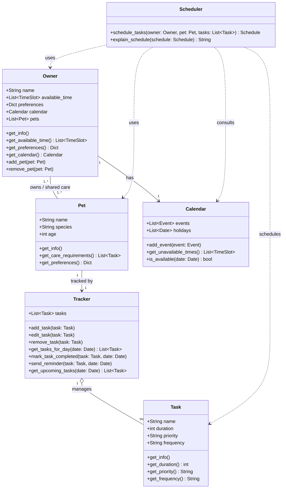

```mermaid
classDiagram
    class Owner {
        +String name
        +List~TimeSlot~ available_time
        +Dict preferences
        +Calendar calendar
        +List~Pet~ pets
        +get_info()
        +get_available_time() List~TimeSlot~
        +get_preferences() Dict
        +get_calendar() Calendar
        +add_pet(pet: Pet)
        +remove_pet(pet: Pet)
    }

    class Pet {
        +String name
        +String species
        +int age
        +get_info()
        +get_care_requirements() List~Task~
        +get_preferences() Dict
    }

    class Task {
        +String name
        +int duration
        +String priority
        +String frequency
        +get_info()
        +get_duration() int
        +get_priority() String
        +get_frequency() String
    }

    class Tracker {
        +List~Task~ tasks
        +add_task(task: Task)
        +edit_task(task: Task)
        +remove_task(task: Task)
        +get_tasks_for_day(date: Date) List~Task~
        +mark_task_completed(task: Task, date: Date)
        +send_reminder(task: Task, date: Date)
        +get_upcoming_tasks(date: Date) List~Task~
    }

    class Scheduler {
        +schedule_tasks(owner: Owner, pet: Pet, tasks: List~Task~) Schedule
        +explain_schedule(schedule: Schedule) String
    }

    class Calendar {
        +List~Event~ events
        +List~Date~ holidays
        +add_event(event: Event)
        +get_unavailable_times() List~TimeSlot~
        +is_available(date: Date) bool
    }

    Owner "1..*" -- "1..*" Pet : owns / shared care
    Pet "1" --> "1" Tracker : tracked by
    Tracker "1" o-- "many" Task : manages
    Owner "1" --> "1" Calendar : has
    Scheduler ..> Owner : uses
    Scheduler ..> Pet : uses
    Scheduler ..> Task : schedules
    Scheduler ..> Calendar : consults
```
