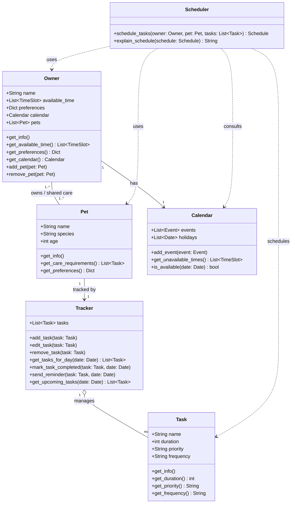
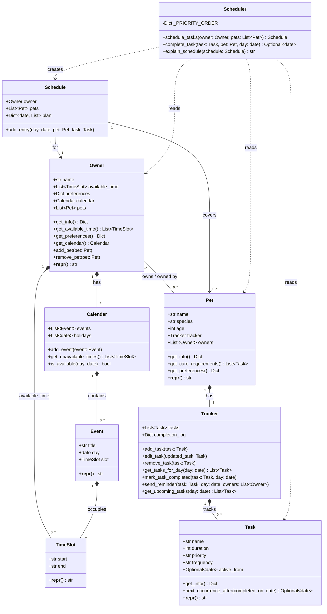
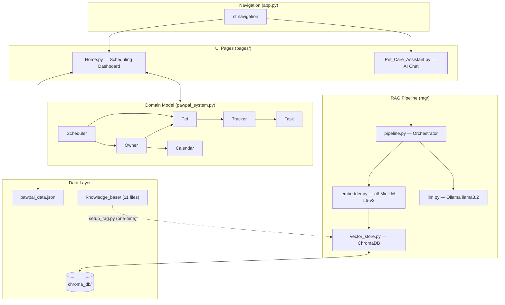
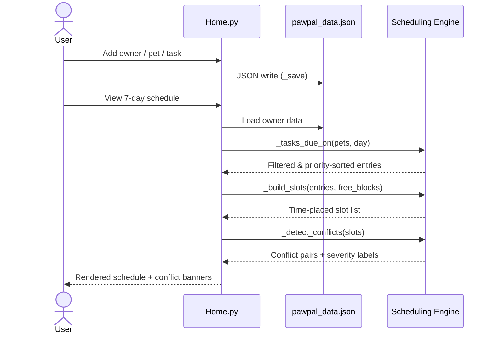
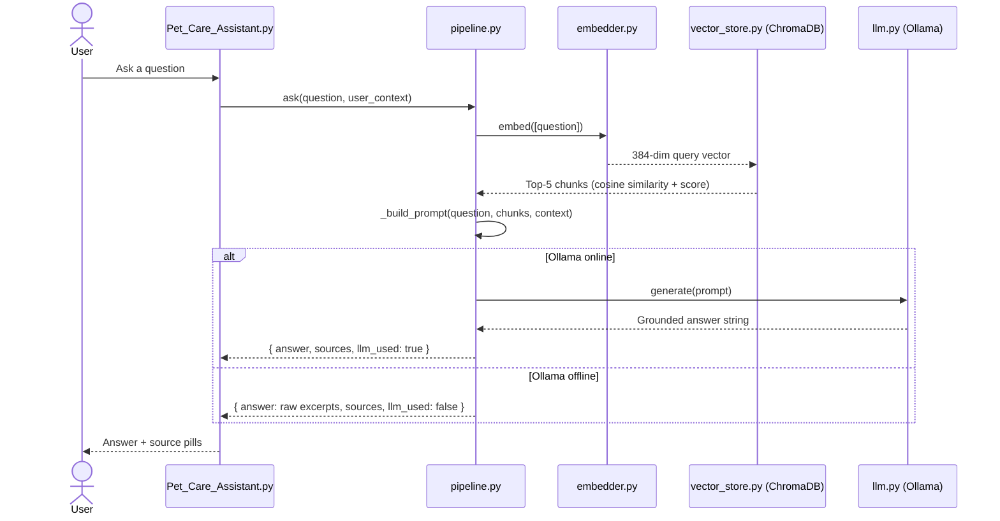

# Architecture

← [Back to README](../README.md)

---

## Table of Contents

1. [Class Diagram — Initial Design](#class-diagram--initial-design)
2. [Class Diagram — Final Implementation](#class-diagram--final-implementation)
3. [Class Responsibilities](#class-responsibilities)
4. [Key Design Decisions](#key-design-decisions)
5. [Component Map](#component-map)
6. [Data Flow — Scheduling](#data-flow--scheduling)
7. [Data Flow — AI Assistant](#data-flow--ai-assistant)

---

## Class Diagram — Initial Design

Drafted during the design phase, before implementation began.

---

## Class Diagram — Final Implementation

Reflects the actual class structure after implementation — all attributes, methods, and relationships included.

---

## Class Responsibilities

| Class | Responsibility |
|-------|----------------|
| **TimeSlot** | Represents a `start`–`end` time window (e.g. `"09:00"`). |
| **Event** | A named calendar event tied to a specific day and time slot. |
| **Task** | A care task with name, duration, priority, frequency, and optional `active_from` for deferred scheduling. |
| **Tracker** | Manages a pet's task list and completion log; handles auto-rescheduling via `active_from`. |
| **Pet** | A pet with species, age, and an embedded `Tracker`; participates in a many-to-many relationship with `Owner`. |
| **Calendar** | Stores events and holidays for an owner; answers availability queries. |
| **Owner** | A pet owner with available time slots, preferences, a `Calendar`, and a list of pets. |
| **Schedule** | Output of scheduling: a day-keyed plan of `(Pet, Task)` pairs for a given owner. |
| **Scheduler** | Stateless service that builds a 7-day `Schedule`, marks tasks complete, and produces human-readable summaries. |

---

## Key Design Decisions

- **Many-to-many Owner ↔ Pet** — `Owner.add_pet()` and `Owner.remove_pet()` keep both sides (`owner.pets` and `pet.owners`) in sync.
- **Deferred scheduling via `active_from`** — When a task is marked complete, `Tracker.mark_task_completed()` replaces it with a new instance whose `active_from` is the next due date, hiding it until then.
- **Priority ordering** — `Scheduler._PRIORITY_ORDER = {"high": 0, "medium": 1, "low": 2}` drives sort order inside `schedule_tasks()`.
- **Conflict detection** (`app.py`) — `_detect_conflicts()` scans all scheduled slots for overlapping pairs using an O(n²) pairwise check.
- **Slot builder** (`app.py`) — `_build_slots()` separates single-occurrence tasks (stacked sequentially) from multi-occurrence tasks (spread proportionally across free blocks).

---

## Component Map

---

## Data Flow — Scheduling

---

## Data Flow — AI Assistant

