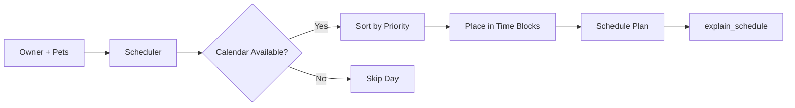
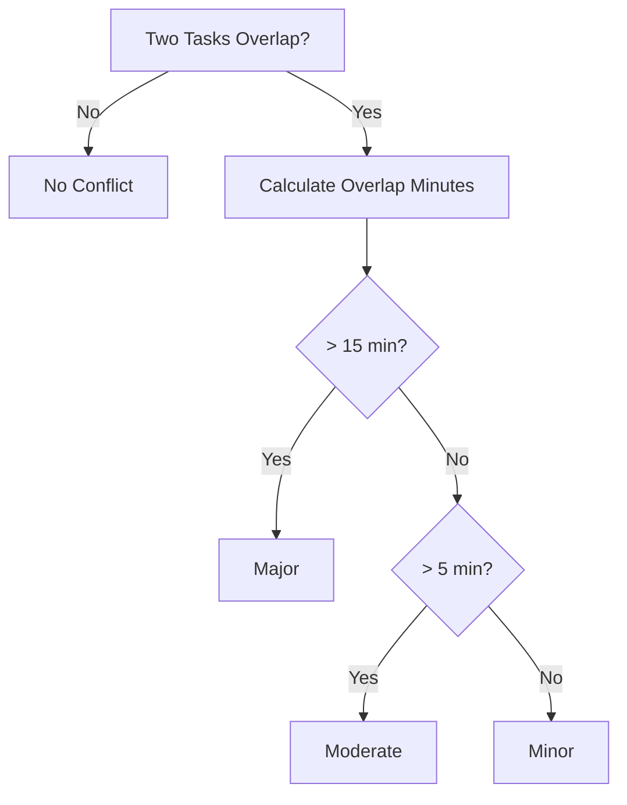

# Scheduling Engine

← [Back to README](../README.md)

---

## Table of Contents

1. [Overview](#overview)
2. [7-Day Schedule Generation](#7-day-schedule-generation)
3. [Time-Aware Slot Placement](#time-aware-slot-placement)
4. [Conflict Detection & Resolution](#conflict-detection--resolution)

---

## Overview

The scheduling engine lives in `pawpal_system.py` (domain logic) and `pages/Home.py` (UI-layer scheduling helpers). Together they turn a list of pets and tasks into a time-placed, conflict-checked daily plan.



---

## 7-Day Schedule Generation

### Recurrence Rules

| Frequency | Appears on |
|-----------|------------|
| `daily`   | Every day  |
| `weekly`  | Mondays    |
| `monthly` | 1st of month |

### Priority Ordering

Tasks within each day are sorted using a fixed map:

```python
_PRIORITY_ORDER = {"high": 0, "medium": 1, "low": 2}
```

Unknown priority values sort last.

### Calendar Awareness

Days blocked by an `Event` or marked as holidays in the owner's `Calendar` are skipped entirely — no tasks are placed on unavailable days.

### Deferred Activation (`active_from`)

When a task is marked complete, `Tracker.mark_task_completed()` replaces it with a new instance whose `active_from` equals the next due date. The task is invisible in the schedule until that date arrives.

### Natural-Language Explanation

`Scheduler.explain_schedule()` converts the raw schedule into a formatted, human-readable summary grouped by day, showing priority, pet name, task name, duration, and frequency.

---

## Time-Aware Slot Placement

The UI layer (`_build_slots()` in `Home.py`) places tasks inside the owner's free time blocks around any configured busy window (e.g., work hours `08:00–17:00`).

### Free-Block Extraction

The owner's day is split into free segments around the busy window. Tasks are only placed inside free blocks.

### Single-Occurrence Tasks

Tasks that occur once per day are stacked sequentially from the start of the first free block. If a task would overflow the current block, it advances to the next available block.

### Multi-Occurrence Tasks

Tasks that repeat multiple times per day (e.g., feeding 3×/day) are spread evenly across all free blocks by dividing each block into equal sub-intervals and centering each occurrence within its sub-interval.

### Busy-Window Enforcement

No task is ever placed inside a configured busy window. Overflow advances to the next free block rather than being dropped.

---

## Conflict Detection & Resolution

### Detection Algorithm

`_detect_conflicts()` performs an O(n²) pairwise scan of all scheduled slots on a given day. Two tasks conflict when one starts before the other ends.

### Severity Classification

| Severity | Overlap | Indicator |
|----------|---------|-----------|
| Minor    | 1–5 min    | Yellow |
| Moderate | 6–15 min   | Orange |
| Major    | > 15 min   | Red    |



### UI Resolution Tools

- **Color-coded banner** — Appears at the top of each day's view immediately when conflicts exist.
- **Side-by-side task cards** — Both conflicting tasks shown with time range and priority.
- **Visual timeline bar** — Proportionally scaled bar with the overlap region highlighted.
- **Priority-aware suggestion** — Identifies the lower-priority task and recommends shortening it by exactly the overlap duration.
- **One-click auto-fix** — Applies the suggestion with a single button press.
- **Manual override** — Either task's duration can be adjusted to any custom value.
- **Severity-driven expander behavior** — Major and Moderate panels open automatically; Minor panels start collapsed.
