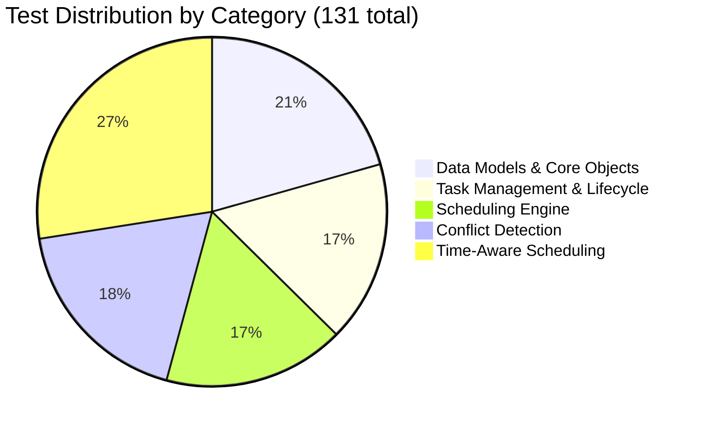
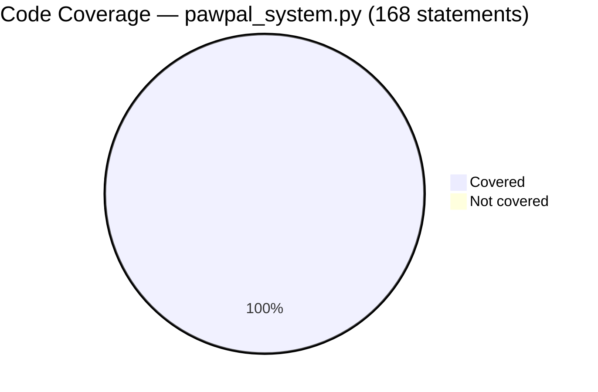

# Testing

← [Back to README](../README.md)

---

## Table of Contents

1. [Running the Tests](#running-the-tests)
2. [Test Distribution](#test-distribution)
3. [Category Breakdown](#category-breakdown)
4. [Edge Case Coverage](#edge-case-coverage)
5. [Code Coverage](#code-coverage)

---

## Running the Tests

```bash
source .venv/bin/activate   # Windows: .venv\Scripts\activate

# Run all tests
python -m pytest

# Verbose output
python -m pytest -v

# Filter by category
python -m pytest -v -k "Conflict"

# With coverage report
pip install pytest-cov
python -m pytest --cov=pawpal_system --cov-report=term-missing
```

**Last run result:**

```
131 passed, 1 warning in 0.32s
```

---

## Test Distribution

The 131 tests are organized into 5 functional categories.



---

## Category Breakdown

### 1. Data Models & Core Objects — 27 tests

Validates that every domain object is constructed correctly, exposes the right data, and maintains accurate relationships.

| Test Class | Tests | What Is Verified |
|---|:---:|---|
| `TestTask` | 2 | Field values, string representation |
| `TestTimeSlot` | 1 | String representation |
| `TestEvent` | 1 | String representation |
| `TestCalendar` | 5 | Adding events, holiday blocking, availability queries, unavailable-time retrieval |
| `TestPet` | 7 | Pet info, care requirements, species-based schedule preferences, owner linkage |
| `TestOwner` | 9 | Owner info, bidirectional pet linking, duplicate prevention, shared-pet multi-owner scenarios |

### 2. Task Management & Lifecycle — 22 tests

Covers the full lifecycle of a task: creation, editing, removal, completion, reminders, and the `active_from` gate.

| Test Class | Tests | What Is Verified |
|---|:---:|---|
| `TestTracker` | 14 | Add / remove / edit tasks, deduplication, frequency filtering, completion logging, upcoming-task countdown, reminder output |
| `TestTrackerActiveFrom` | 5 | Task hidden before `active_from`; visible on and after the activation date (daily and weekly variants) |

### 3. Scheduling Engine — 22 tests

End-to-end tests of the `Scheduler` class, including day ordering, recurrence, and natural-language output.

| Test Class | Tests | What Is Verified |
|---|:---:|---|
| `TestScheduler` | 9 | Schedule generation, daily task inclusion, unavailable-day skipping, priority ordering, `explain_schedule` content |
| `TestChronologicalOrdering` | 5 | Plan days in ascending order, only future/today dates included, 7-day window enforced |
| `TestRecurrenceLogic` | 6 | Completed task reappears the next cycle, `active_from` advances correctly after completion |

### 4. Conflict Detection — 24 tests

Verifies the overlap-detection algorithm and severity classifier across all boundary conditions.

| Test Class | Tests | What Is Verified |
|---|:---:|---|
| `TestDetectConflicts` | 9 | No-conflict cases, partial overlap, identical slots, full containment, three-slot multi-pair scenarios |
| `TestConflictSeverity` | 8 | Boundary values for Minor / Moderate / Major thresholds, correct severity labels |
| `TestSchedulerConflictDetection` | 5 | Duplicate start times flagged, both task names surfaced, sequential tasks not flagged |

### 5. Time-Aware Scheduling — 36 tests

Tests task placement within free time blocks, busy-period enforcement, and multi-occurrence distribution.

| Test Class | Tests | What Is Verified |
|---|:---:|---|
| `TestTasksDueOnFiltering` | 7 | Daily / weekly / monthly tasks filtered to correct days, multi-pet scenarios, empty edge cases |
| `TestTasksDueOnSorting` | 3 | High → Medium → Low priority order, unknown priorities sort last |
| `TestTimesPerDay` | 7 | Correct slot count per occurrence, distinct start times, even spread, chronological ordering |
| `TestBusyTimeExclusion` | 6 | No slots when fully busy, tasks placed inside free blocks, overflow advances to the next block |

---

## Edge Case Coverage

Of the 131 total tests, **42 explicitly target edge and boundary conditions** (~32%).

| Edge Case Category | Count | Representative Tests |
|---|:---:|---|
| **Empty / Null Inputs** | 8 | No pets, no tasks, empty conflict list, empty schedule, empty care requirements |
| **Boundary Values** | 9 | Conflict severity at exactly 5, 6, and 15 minutes; `active_from` on exact activation date; 7-day window boundary |
| **Invalid / Unknown Inputs** | 4 | Unknown priority level (`"urgent"`), editing a non-existent task, removing an absent task |
| **Blocked / Unavailable Scenarios** | 6 | No free time blocks, fully busy calendar day, holiday blocking, overflow to next block |
| **Duplicate Prevention** | 4 | Adding the same task twice, adding the same pet twice, duplicate owner–pet links |
| **Completion & Recurrence** | 5 | Completed task absent on same day, reappears next cycle, monthly task unchanged |
| **Conflict Geometry** | 4 | Identical start/end times, complete containment, sequential (touching) slots, gap between slots |
| **Isolation & Independence** | 2 | Blocking one owner's calendar does not affect another's; completion log keyed by object identity |

---

## Code Coverage

The test suite targets `pawpal_system.py` — the entire backend logic layer.

| Module | Statements | Missed | Coverage |
|--------|:----------:|:------:|:--------:|
| `pawpal_system.py` | 168 | 0 | **100%** |



**Confidence: 4 / 5**

The entire backend is covered at 100% across 5 functional layers with 42 dedicated edge and boundary cases. The gap is the Streamlit UI layer (`app.py`) and AI assistant features, which are not covered by automated tests. Adding integration or snapshot tests for the UI would push this to 5 stars.

> Coverage is measured against `pawpal_system.py` only. The Streamlit UI (`app.py`) is excluded from the automated test run.
