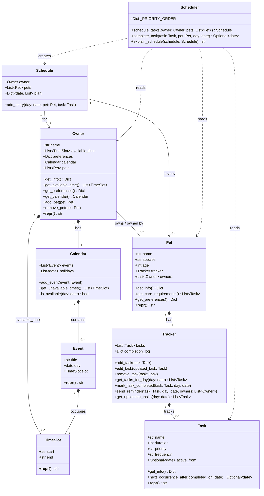

# PawPal+ — Final UML Class Diagram

---

## Class Responsibilities

| Class | Responsibility |
|-------|---------------|
| **TimeSlot** | Represents a `start`–`end` time window (strings like `"09:00"`). |
| **Event** | A named calendar event tied to a specific day and `TimeSlot`. |
| **Task** | A care task with name, duration, priority, frequency, and optional `active_from` date for deferred scheduling. |
| **Tracker** | Manages a pet's task list and completion log; handles auto-rescheduling via `active_from`. |
| **Pet** | A pet with species, age, and an embedded `Tracker`; participates in a many-to-many relationship with `Owner`. |
| **Calendar** | Stores events and holidays for an owner; answers availability queries. |
| **Owner** | A pet owner with available time slots, preferences, a `Calendar`, and a list of pets. |
| **Schedule** | The output of scheduling: a day-keyed plan of `(Pet, Task)` pairs for a given owner. |
| **Scheduler** | Stateless service that builds a 7-day `Schedule`, marks tasks complete, and produces human-readable summaries. |

---

## Key Design Decisions

- **Many-to-many Owner ↔ Pet**: `Owner.add_pet()` / `Owner.remove_pet()` keep both sides (`owner.pets` and `pet.owners`) in sync.
- **Deferred scheduling via `active_from`**: When a task is marked complete, `Tracker.mark_task_completed()` replaces it with a new instance whose `active_from` is set to the next due date, hiding it until then.
- **Priority ordering**: `Scheduler._PRIORITY_ORDER = {"high": 0, "medium": 1, "low": 2}` drives sort order inside `schedule_tasks()` and the app-level `_tasks_due_on()`.
- **Conflict detection** (`app.py`): `_detect_conflicts()` scans all scheduled slots for overlapping `_start_raw`/`_end_raw` pairs (O(n²) pairwise check).
- **Scheduling engine** (`app.py`): `_build_slots()` separates single-occurrence tasks (stacked sequentially) from multi-occurrence tasks (spread proportionally across free blocks by duration).
